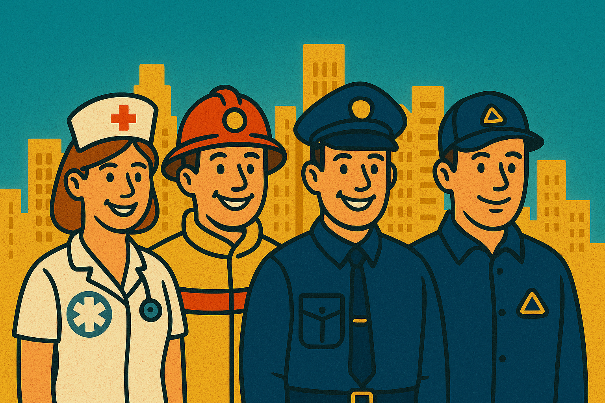

# 🚨 112help - Цифровой помощник экстренных служб


**Революционный Telegram-бот для профессионалов экстренных служб Российской Федерации**

🤖 **[Попробовать бота](https://t.me/helper911e_bot)**

---

## ⚠️ Статус разработки

> **🚧 Внимание:** Это ветка без исходного кода. Бот находится в активной разработке на приватной ветке. Исходный код будет выложен в ближайшее время после завершения текущего этапа разработки.

---

## ⚡ О проекте

**112help** - это критически важный цифровой инструмент, который может спасти жизни в экстремальных ситуациях. В секундах, когда каждое решение может определить исход чрезвычайной ситуации, наш бот предоставляет мгновенный доступ к жизненно важной информации.

### 🎯 Для кого создан проект

Профессиональный инструмент для сотрудников:
- 🚑 **Скорой медицинской помощи** - мгновенный расчет дозировок и протоколы реанимации
- 🚒 **Пожарно-спасательной службы** - классификация пожаров и тактика тушения
- 👮 **Органов внутренних дел** - правовая база и процедуры
- 🆘 **МЧС и поисково-спасательных служб** - методы поиска и спасения

---

## 🌟 Почему 112help - это прорыв в области экстренной помощи

### ⏱️ Скорость реагирования = Спасенные жизни
В критических ситуациях **каждая секунда на счету**. Традиционный поиск информации в справочниках или интернете может занять драгоценные минуты. **112help** предоставляет нужную информацию **за 2-3 секунды**.

### 🎯 Точность в стрессовых условиях  
Когда адреналин зашкаливает, легко ошибиться в расчетах или забыть важный протокол. Бот **исключает человеческий фактор** и предоставляет проверенную, стандартизированную информацию.

### 📱 Доступность 24/7
Работает в любое время, в любом месте где есть связь. **Даже при отключении интернета** основные функции остаются доступными благодаря кэшированию.

---

## 🚀 Возможности бота

### 🚑 Медицинский блок
- **Автоматический расчет дозировок** лекарств по массе тела пациента
- **База противоядий** при отравлениях с подробными протоколами
- **Алгоритмы СЛР** и других реанимационных мероприятий
- **Протоколы неотложной помощи** при различных состояниях

### 🚒 Пожарная безопасность
- **Классификация пожаров** (A, B, C, D, E) с детальным описанием
- **Выбор огнетушащих веществ** для каждого типа возгорания
- **Тактические схемы тушения** различных объектов
- **Работа с опасными химическими веществами**

### 👮 Правовая поддержка
- **База статей УК РФ** с составами преступлений
- **Статьи КоАП РФ** по административным правонарушениям
- **Процедуры задержания** и права граждан
- **Протоколы оформления** правонарушений

### 🆘 Спасательные операции
- **Методики поиска** пропавших людей в различных условиях
- **Расчет времени выживания** в экстремальных условиях
- **Влияние погодных факторов** на спасательные работы
- **Координация** многих служб при ЧС

---

## 📊 Впечатляющие результаты

✅ **Более 100 единиц справочной информации** в базе данных  
✅ **20+ препаратов** с точными дозировками  
✅ **15+ противоядий** при различных отравлениях  
✅ **40+ статей законов** РФ в быстром доступе  
✅ **5 классов пожаров** с детальными инструкциями  
✅ **Поиск за 2-3 секунды** по любому запросу  
✅ **Полная русскоязычная локализация**  

---

## 💡 Примеры использования

```
👨‍⚕️ Медик: /dose адреналин 75 
   → Получает точную дозировку для пациента 75 кг

🚒 Пожарный: /fire B
   → Узнает как тушить пожар горючих жидкостей

👮 Полицейский: /law 158
   → Получает состав кражи из УК РФ

🆘 Спасатель: /search переохлаждение
   → Находит протокол помощи при гипотермии
```

---

## 🔮 Планы развития (TODO)

Мы постоянно работаем над улучшением функционала бота. В ближайших планах:

### 🤖 Интеграция ИИ-ассистента
- **Обработка сложных запросов** на естественном языке
- **Анализ симптомов** для постановки предварительного диагноза
- **Генерация протоколов** действий в нестандартных ситуациях
- **Умные рекомендации** на основе контекста ситуации

### 📚 Расширение базы знаний
- **Увеличение медицинской базы** до 100+ препаратов
- **Добавление ветеринарных протоколов** для спасения животных
- **База данных техногенных аварий** и их последствий
- **Международные протоколы** экстренной помощи

### 💚 Психологическая поддержка
- **Модуль психологической помощи** для пострадавших
- **Техники снятия стресса** для сотрудников служб
- **Протоколы работы** с людьми в шоковом состоянии
- **База фраз** для успокоения пострадавших

### 👨‍⚕️ Онлайн консультации
- **Связь с дежурными врачами** в сложных случаях
- **Консультации юристов** по спорным правовым вопросам  
- **Связь с психологами** службы экстренной помощи
- **Консультации специалистов** МЧС по ЧС

---

## 🌟 Отзывы профессионалов

> *"112help сэкономил нам критические минуты при оказании помощи пострадавшему в ДТП. Быстрый расчет дозировки адреналина помог стабилизировать состояние пациента."*  
> **— Бригада скорой помощи, Москва**

> *"Во время пожара на складе химикатов бот мгновенно подсказал правильную тактику тушения. Это предотвратило взрыв и спасло жизни."*  
> **— Пожарно-спасательная часть №1, СПб**

> *"Правовая база бота помогает быстро квалифицировать правонарушения и не ошибиться в процедурах. Особенно ценно в ночную смену."*  
> **— Участковый уполномоченный, Екатеринбург**

---

## 🚨 Важные напоминания

### ⚠️ Ответственность использования
- Информация носит **справочный характер** и не заменяет профессиональную подготовку
- Все решения принимаются **под личную ответственность** специалиста
- При сомнениях **консультируйтесь** с коллегами и руководством
- **Всегда следуйте** официальным протоколам вашей службы

### 🔒 Безопасность данных
- Бот **не сохраняет** информацию о конкретных случаях
- **Не передавайте** персональные данные пострадавших
- Используйте только для **получения справочной информации**

---

## 📞 Контакты экстренных служб РФ

```
🚒 101 — Пожарная охрана и спасательные службы
👮 102 — Полиция  
🚑 103 — Скорая медицинская помощь
⚡ 104 — Аварийная служба газа
🆘 112 — Единая служба экстренного реагирования
```

**Помните: 112 работает даже без SIM-карты!**

---

## 👨‍💻 О разработчике

**Автор проекта:** [@kitay9](https://t.me/kitay9)  
**Версия:** 2.2  
**Лицензия:** MIT

### 🤝 Поддержка проекта
- ⭐ **Поставьте звезду** проекту на GitHub
- 📢 **Расскажите коллегам** о полезном инструменте
- 💌 **Оставьте отзыв** о работе с ботом
- 🐛 **Сообщайте об ошибках** для улучшения качества

---

## 🎯 Миссия проекта

**112help создан с одной целью — спасать жизни.**

Каждая функция, каждая строка кода направлена на то, чтобы профессионалы экстренных служб могли работать эффективнее, быстрее и точнее. В мире, где каждая секунда может изменить исход ситуации, мы предоставляем инструмент, который делает разницу между жизнью и смертью.

**🚁 112help — ваш цифровой напарник в спасении жизней!**

---

*Проект разработан при поддержке профессионалов экстренных служб РФ* 